# Statistical Analysis of Spotify Track Popularity

**Course:** MH3511 Data Analysis with Computer Group Project

---

## Abstract
With music streaming platforms becoming a major part of how people consume music today, platforms like Spotify rely on various data to recommend songs to users. However, a track's popularity can be influenced by a variety of factors, ranging from audio features such as danceability, acousticness, valence, energy, tempo to the genre the song belongs to. Hence, this study aims to examine the relationship between track popularity and different audio features, as well as whether popularity differs across genres, using basic data analysis techniques.

---

## 1. Introduction
Advancements in technology have transformed the way people discover and consume music. In the early 2000s, music was commonly accessed through physical media such as CDs or digital devices like MP3 players. With the development of smartphones and faster internet connectivity, music streaming platforms began to grow rapidly. Among these platforms, Spotify has emerged as a world-leading streaming and subscription service, with an extensive catalogue of tracks, podcasts and audiobooks. 

As of December 2025, Spotify has over 751 million active users and 290 million subscribers. One of Spotify's most well-known features is its annual "Spotify Wrapped", which provides users with a personalised summary of their listening habits, including their most frequently played songs, artists and genres. This feature demonstrates how user engagement is analysed, utilising the vast amount of listening data generated by users.

Spotify relies heavily on data-driven algorithms to recommend songs and playlists to listeners, where track popularity of user-preferred genres also plays an important role in determining which songs are promoted and recommended to users. Music on the platform spans a wide variety of genres, characterised by distinct musical styles and audio features. Hence, this research aims to study the relationship between musical characteristics and whether varying characteristics affect popularity across genres.

---

## 2. Data Description
The dataset titled "Spotify Tracks Dataset" is obtained from the online data science and machine learning platform Kaggle, open to the public for study and research.

Before proceeding to data analysis, we first performed a preliminary data cleaning to ensure the quality and consistency of the dataset. Specifically, we conducted the following:
* Consolidated original 100 genres into 19 genres
* Remove duplicated tracks to avoid repeated observations
* Removed observations with popularity equal to 0
* Performed normalisation on the numerical variables used in the study, namely popularity, danceability, energy, valence, tempo, acousticness

After the data cleaning, 80,293 observations with 8 variables are retained for analysis:
* **track_id:** Unique identifier for each track, represented as a character string.
* **track_genre:** The genre to which the track belongs.
* **popularity:** A measure of track popularity scaled between 0 and 100, where 1 represents the most popular tracks.
* **acousticness:** Standardised z-score of the likelihood a track is acoustic. Values below 0 indicate less acoustic than average; values above 0 indicate more acoustic than average.
* **danceability:** Standardised z-score of danceability. Values below 0 indicate less danceable than average; values above 0 indicate more danceable than average.
* **energy:** Standardised z-score of energy. Values below 0 indicate lower energy than average; values above 0 indicate higher energy than average.
* **valence:** Standardised z-score of valence. Values below 0 indicate less positive (sadder) tracks; values above 0 indicate more positive (happier) tracks.
* **tempo:** Standardised z-score of tempo. Values below 0 indicate slower tracks; values above 0 indicate faster tracks relative to the dataset.

---

## 3. Objectives of the Study
The primary objective of the study is to investigate how musical characteristics and genre influence track popularity on Spotify, and whether these vary across genres. By determining if certain traits contribute to its popularity in specific genres, we can better understand the preferences of listeners on streaming platforms in the digital era. 

Our selected response variable is track popularity, evaluated via Spotify's algorithm that is based on the total number of plays and their recency. Independent variables include various numerical audio variables, namely, danceability, energy, valence, tempo, and acousticness. We have also identified the categorical variable, Super Genres, which is derived from consolidating Spotify genres into larger, more general genres, as another critical independent variable. Additionally, we examine whether genre acts as a moderator for the popularity of different tracks with different variations of musical characteristics through an interaction variable of both aforementioned independent variables, musical characteristics and genre.

In order to aid with our study, we aim to answer the following questions:
* Is there a statistically significant difference in the popularity of musical tracks on Spotify across genres?
* What is the correlation between different musical characteristics and track popularity?
* Does the prevalence and impact of a specific musical characteristic vary across different super-genres?

---

## 4. Exploratory Data Analysis

### 4.1 Data Overview & Summary Statistics

### code used
[Exploratory Data Analysis](spotify analysis code/Exploratory Data Analysis.R)

#### 4.1.1 Response Variable: Popularity
| Variable | Mean | SD | Min | Q1 | Median | Q3 | Max |
| :--- | :--- | :--- | :--- | :--- | :--- | :--- | :--- |
| Popularity | 37.1 | 18.1 | 1.0 | 22.0 | 37.0 | 50.0 | 100.0 |

#### 4.1.2 Predictor Variables
All numeric predictor variables were standardised before analysis to place them on a common scale. As a result, their means and standard deviations are approximately 0 and 1.

| Variable | Min | Q1 | Median | Q3 | Max |
| :--- | :--- | :--- | :--- | :--- | :--- |
| Acousticness | -0.9601 | -0.9150 | -0.4192 | 0.8659 | 2.0166 |
| Danceability | -3.2044 | -0.6311 | 0.0749 | 0.7353 | 2.4034 |
| Energy | -2.5191 | -0.6874 | 0.1616 | 0.8534 | 1.4115 |
| Tempo | -4.0718 | -0.7490 | -0.0028 | 0.6121 | 4.0191 |
| Valence | -1.7853 | -0.8351 | -0.0490 | 0.8058 | 2.0117 |

### 4.2 Univariate Analysis

#### 4.2.1 Popularity
Popularity is mildly positively skewed, with most observations concentrated in the lower to middle range and a longer tail towards higher values. The histogram suggests slight multimodality, as shown by several local peaks. The Q-Q plot shows deviation from normality, with the largest departures occurring in the lower and upper tails. Popularity is therefore unlikely to be normally distributed.

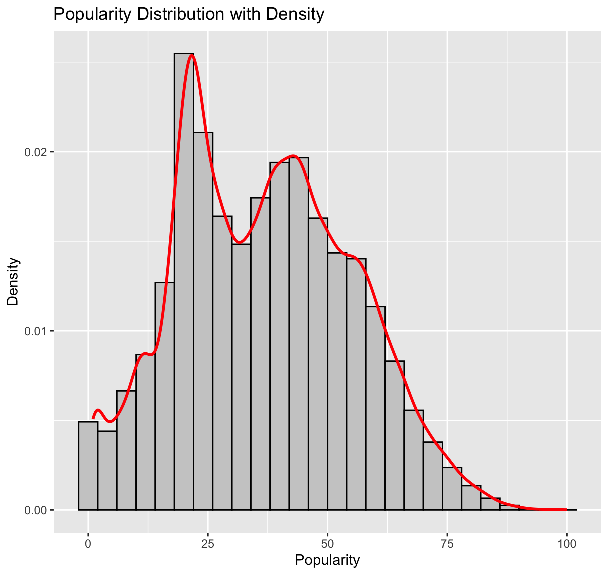(images/popularity_qq.png)

#### 4.2.2 Danceability
Danceability shows slight negative skew, with most observations concentrated around the middle of the distribution and a longer left tail. It is unimodal and centred close to zero. The Q-Q plot shows deviation from normality, with the largest departures occurring in the upper tails. Danceability is therefore unlikely to be normally distributed.

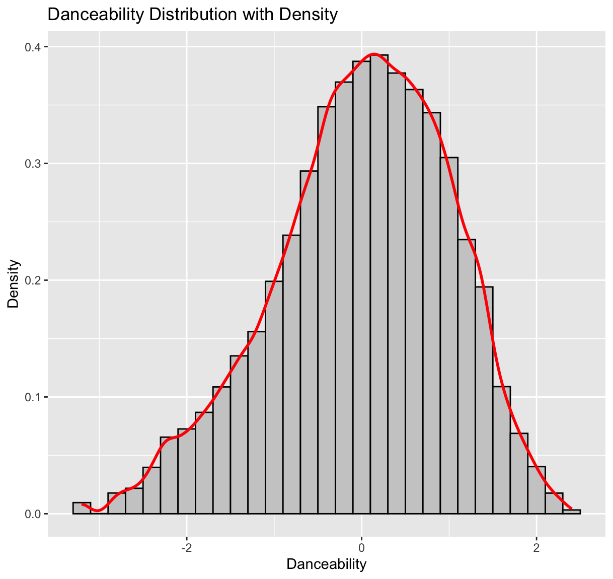(images/danceability_qq.png)

#### 4.2.3 Acousticness
Acousticness is strongly positively skewed, with a pronounced upper tail. Most observations are concentrated near the lower end of the distribution. The histogram also shows a marked spike at low values and a clear departure from unimodality. The Q-Q plot shows substantial deviation from normality, with the largest departures occurring in the lower and upper tails. Acousticness is therefore not normally distributed.

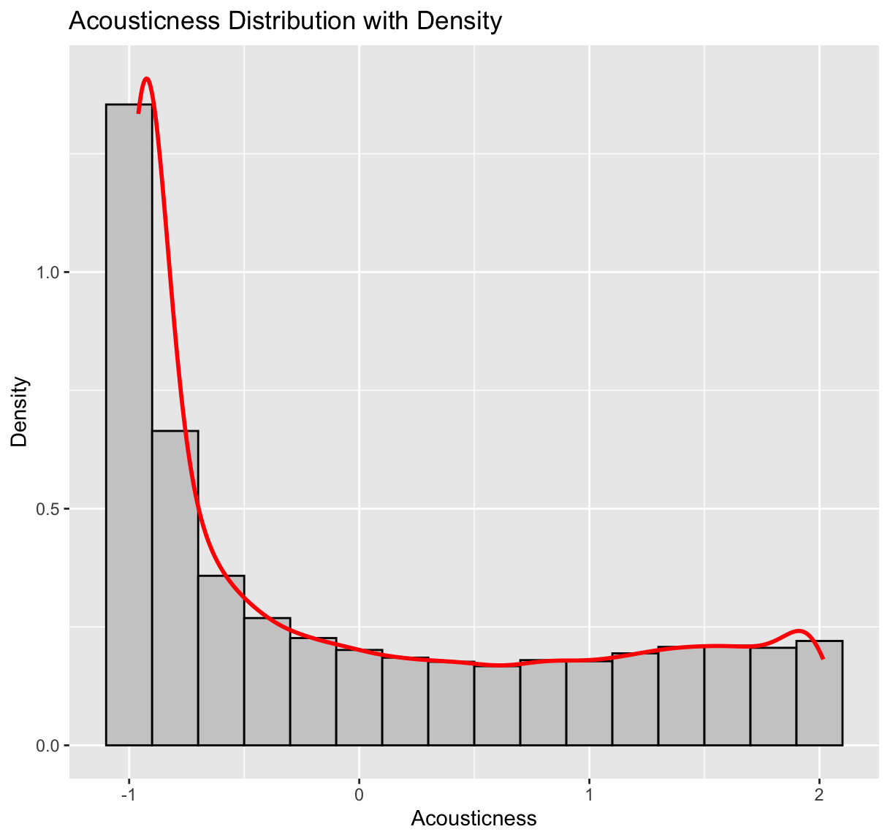(images/acousticness_dist.png)

#### 4.2.4 Valence
Valence shows little overall skew, with tails that are relatively balanced on both sides of the distribution. Most observations are concentrated around the middle range. The histogram is broad and mildly irregular, with several local peaks rather than a single sharply defined mode. The Q-Q plot shows deviation from normality, with the largest departures occurring in the lower and upper tails. Valence is therefore unlikely to be normally distributed.

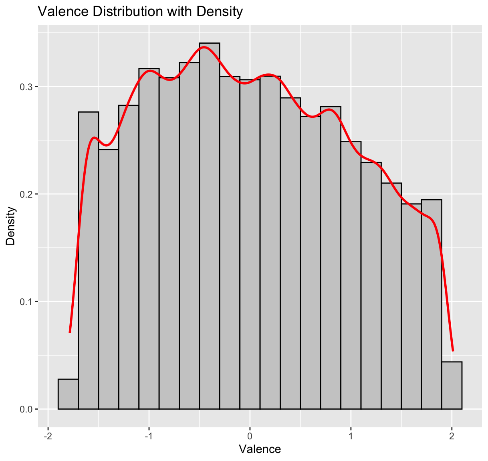(images/valence_qq.png)

#### 4.2.5 Tempo
Tempo shows little overall skew, with a slightly longer upper tail. Most observations are concentrated around the middle of the distribution. The histogram is moderately irregular, with several local peaks rather than a single smooth mode. The Q-Q plot is reasonably consistent with approximate normality, although minor local deviations and tail departures are present.

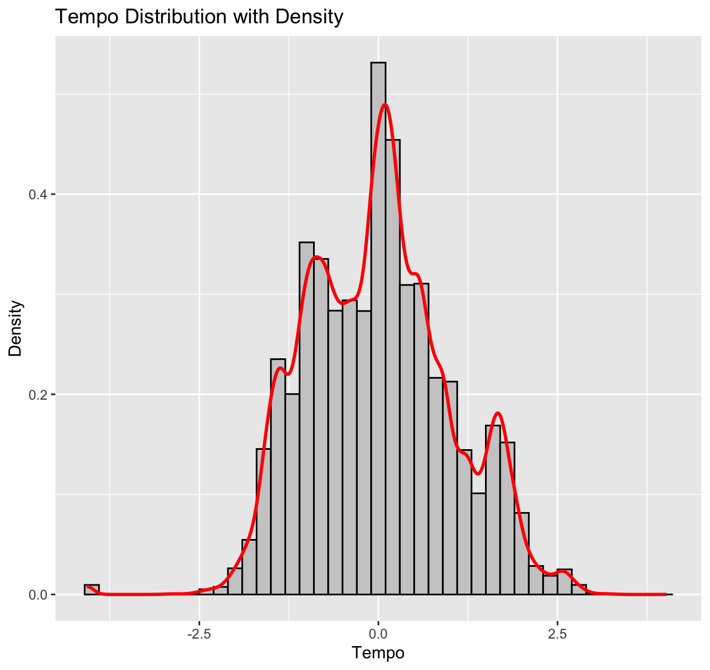(images/tempo_qq.png)

#### 4.2.6 Energy
Energy shows strong negative skew, with a longer and wider lower tail. Most observations are concentrated in the upper half of the distribution. The histogram rises towards a pronounced mode at higher values, indicating that higher energy tracks are more common. The Q-Q plot shows substantial deviation from normality, with the largest departures occurring in the upper tails. Energy is therefore not normally distributed.

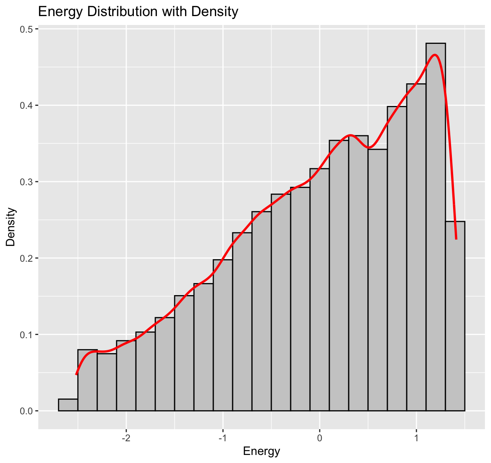(images/energy_qq.png)

#### 4.2.7 Genre
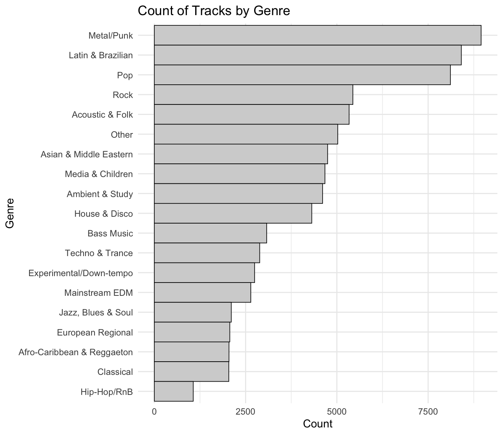

### 4.3 Multivariate Analysis

#### 4.3.1 Correlation Analysis
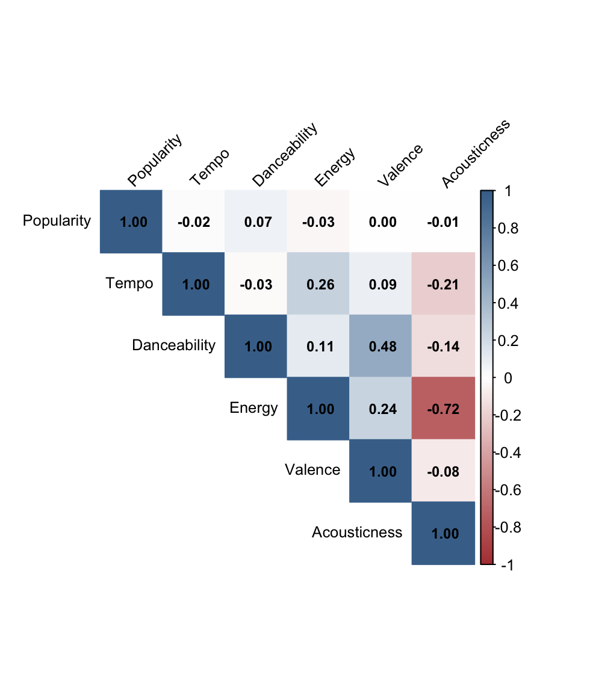

**Popularity and Numeric Predictors**
The correlation matrix reveals that Popularity has a weak linear relationship with all the numeric musical characteristics, with correlations ranging from -0.03 with Energy to 0.07 with Danceability. This may thus suggest that there is no one singular musical characteristic that serves as a strong predictor for Popularity, and may instead be driven by a combination of factors, or external influences such as marketing of the track.

**Correlation among Predictors**
The matrix also highlights significant relationships between the musical characteristics themselves. Notably, there is a strong negative correlation of -0.72 between energy and acousticness, indicating that high-intensity elements display low acoustic properties. Additionally, Danceability and Valence also show a moderate positive correlation of 0.48, suggesting that positive-sounding music is generally more danceable.

#### 4.3.2 Popularity across Genre Groups
To assess whether popularity differs across Genre Groups, both a chi-square test of independence and a one-way ANOVA were conducted.

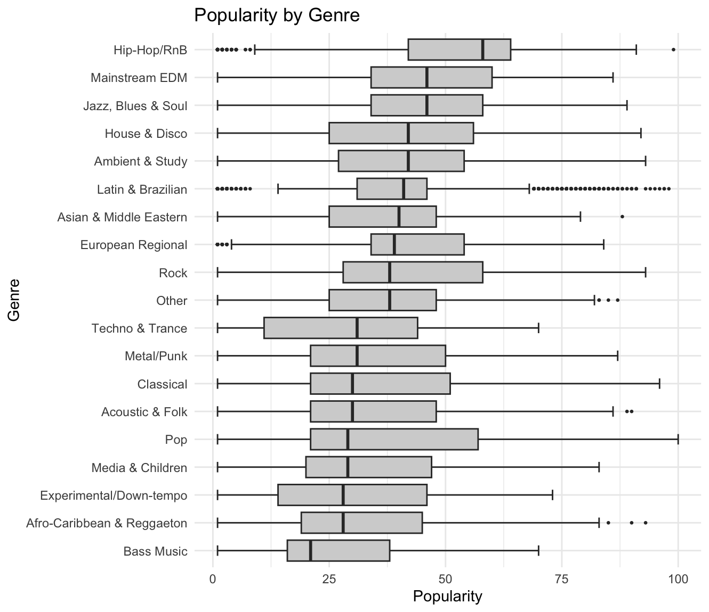

**Chi-Square Test**
Pearson's chi-square tests of independence were conducted to examine whether popularity category is associated with super genre and grouped musical characteristics. We converted popularity into categorical groups (Low, Medium, High) using quantile-based cutoffs, and then applied chi-square tests of independence between popularity category and other categorical variables, including super genre and grouped musical characteristics.

The hypotheses are defined as:
* H0: Variables are independent
* H1: Variables are associated

All tests were statistically significant at the 5% level. In particular, the popularity category was strongly associated with the super genre, X²(36) = 10112, p < 0.001, indicating that the distribution of popularity differs substantially across genres. Significant associations were also found for danceability, X²(4) = 520.99, p < 0.001; energy, X²(4) = 1133, p < 0.001; valence, X²(4) = 741.65, p < 0.001; tempo, X²(4) = 133.02, p < 0.001; and acousticness, X²(4) = 1680.8, p < 0.001. Among the musical characteristics, acousticness showed the strongest association with popularity, while tempo showed the weakest. These results suggest that track popularity is related not only to genre but also to musical profile. 

**ANOVA**
To determine if track popularity differs across music genres, a one-way ANOVA test was conducted.

The hypotheses are defined as:
* H0: The mean popularity is the same across all genres
* H1: At least one genre has a different mean popularity

The ANOVA results showed a F-value of 304.1 and a p-value < 2e-16. Since the p-value is less than 0.05, we reject the null hypothesis and conclude that mean popularity differs significantly across at least some genre groups. 

A pairwise t-test with Holm adjustment was then conducted to determine which specific genre pairs differ significantly in popularity. 161 out of the 171 comparisons have a p-value of < 0.05, indicating that majority genres have significantly different mean popularity levels. However, several genre pairs showed no significant difference in popularity (e.g., Acoustic & Folk and Classical, Afro-Caribbean & Reggaeton and Media & Children, Asian & Middle Eastern and Pop, and Other and Pop exhibit similar mean popularity levels with a p-value of 1.000). 

Overall, these findings suggest that while popularity differs significantly across most genres, a small number of genre pairs exhibit comparable popularity levels, indicating potential overlaps in listener preferences.

---

## 5. Checking Statistical Assumptions

### 5.1 Normality of Numerical Variables
We evaluated the normality of numerical variables visually using a Normal Q-Q plot. Data points of the Q-Q plot mostly follow the 45-degree line, although the points deviate from the 45-degree reference line at the upper and lower ends, indicating longer tails at the ends of the distribution. Despite this, the sample size is large (N = 80,293), and thus the Central Limit Theorem (CLT) ensures that the distribution is approximately normal.

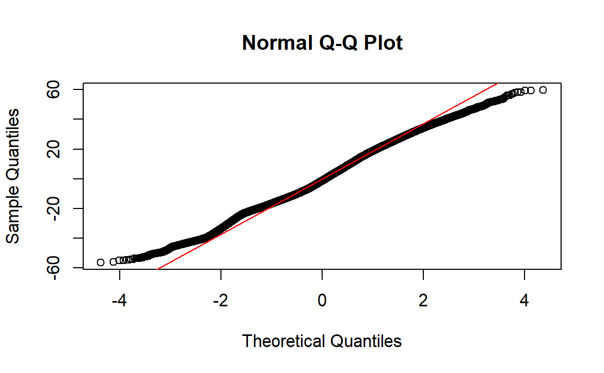

### 5.2 Independence of Observations
The independence assumption states that each observation is unrelated to and does not influence another. As the dataset consists of individual tracks retrieved from the Spotify API, each data point is distinct. By viewing the interaction between musical characteristics and genre, we account for common characteristics of the various musical tracks, and thus ensure that the residuals are random and unique to the individual track.

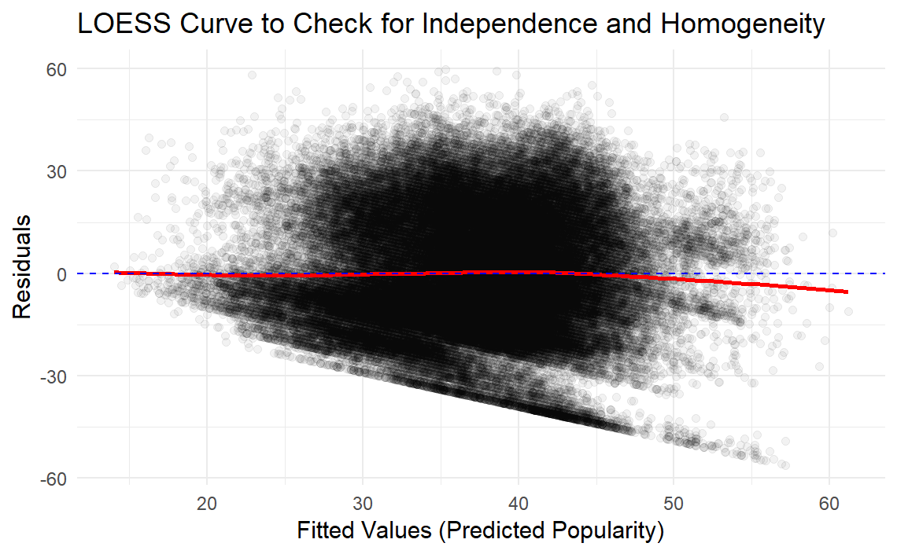

To further test for independence, we plotted the model residuals on a LOESS (Locally Estimated Scatterplot Smoothing) curve due to our large sample size. As shown in the plot, the red LOESS line is mostly horizontal and aligned with the zero-intercept, showing little drifting patterns. Thus, the residuals are independent.

### 5.3 Homogeneity of Variance
Similarly, as the red LOESS line is approximately horizontal at y=0, the "average" error does not differ much as popularity increases. Furthermore, since the vertical spread of the data points is relatively consistent, the model is reliable for different levels of track popularity. 

---

## 6. Regression Analysis
A multiple linear regression model was fitted to examine whether selected musical characteristics and genre were associated with Spotify track popularity. The response variable was popularity, and the predictors were danceability, energy, valence, tempo, acousticness, and super genre treated as a categorical variable. 

### 6.1 Model Fit
The overall regression model was statistically significant, with F(23, 80269) = 293.3 and p < 2.2e-16. This indicates that the predictors are jointly associated with popularity, meaning that at least one predictor has a significant linear relationship with popularity.

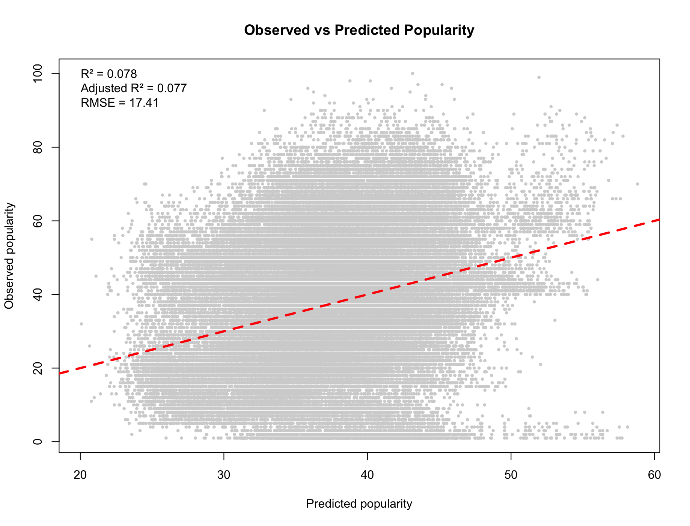(images/predicted_residuals_plots.png)

However, the explanatory power of the model was weak. The model had an R² of 0.0775 and an adjusted R² of 0.0773, meaning that only about 7.75% of the variation in popularity was explained by the included predictors. The residual standard error was 17.41, and the Root mean square error (RMSE) was 17.41, which further indicates that substantial unexplained variation remained in the data.

### 6.2 Numeric Predictors
All five numeric predictors were statistically significant at the 5% level. 
* Danceability had a positive coefficient, indicating that tracks with higher danceability tended to have higher popularity. 
* Tempo also had a positive but smaller effect.
* Energy, valence, and acousticness had negative coefficients, indicating that higher values of these features were associated with lower popularity after controlling for the other variables.

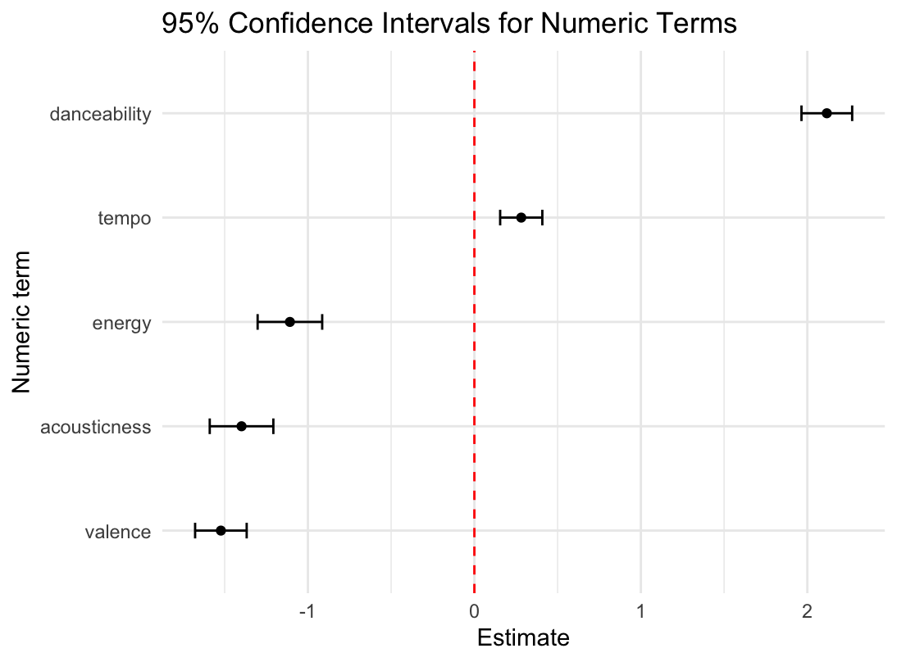

### 6.3 Genre Effects
Genre was included as a categorical predictor, so each genre coefficient represents the difference in popularity relative to the reference genre. Most genre categories were significantly different from the reference group, as shown by the 95% confidence intervals, which largely did not cross zero. 

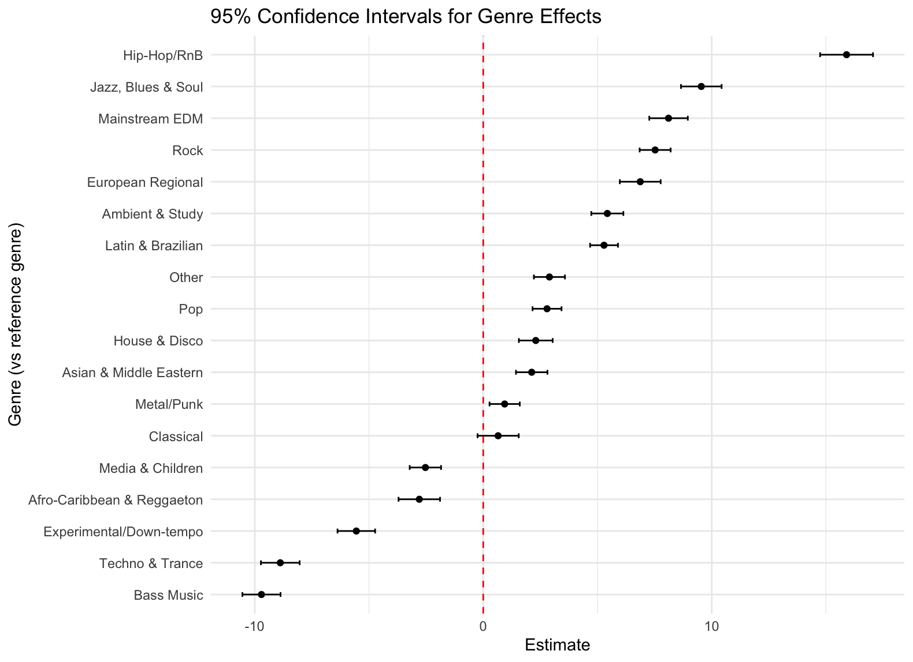

Positive coefficients were observed for genres such as Hip-Hop/RnB, Jazz, Blues & Soul, Mainstream EDM, and Rock, indicating higher predicted popularity relative to the reference genre. Negative coefficients were observed for Bass Music, Techno & Trance, and Experimental/Down-tempo. Only Classical was not significantly different from the reference genre.

### 6.4 Results
The regression results show that several audio features and most genre categories were statistically associated with Spotify popularity. Higher danceability and tempo were associated with higher popularity, whereas higher energy, valence, and acousticness were associated with lower popularity. However, despite the statistical significance of many predictors, the overall model fit remained weak, with only 7.75% of the variance in popularity explained. 

---

## 7. Conclusions and Limitations

### 7.1 Conclusions
This study aimed to examine whether musical characteristics and genre are associated with the popularity of tracks on Spotify. Through various statistical tests and analysis, we conclude that:
* Track popularity differs significantly across genres.
* Individual musical characteristics have weak relationships with popularity, suggesting that no single feature strongly determines a track's popularity.
* While several audio features and genre are statistically significant predictors, the overall model has low explanatory power, suggesting that most variation in popularity remains unexplained.

Overall, we conclude that while genre and musical characteristics are associated with track popularity, they have statistically significant but practically weak effects on popularity, and popularity is likely influenced by additional external factors. 

### 7.2 Limitations
While our analysis provides significant insight on the nature of music and its popularity, it is subject to several limitations:
* The complexity of the music industry and consumer trends suggests that data points may be clustered by artist or label influence, both of which are extremely hard to quantify.
* Our model is limited by omitted variables. There are many strong drivers of popularity, including marketing budgets, artist reputation, social media trends (e.g. on Tiktok) which are not included in the dataset.
* There is an inherent multicollinearity and intricate relationship between certain audio features such as energy and valence, making it challenging to isolate the independent effects of each variable.
* In order to simplify analysis, we consolidated 100 genres into 19 "Super-Genres", which inadvertently leaves out unique characteristics of specific sub-genres.
* Most variables (Popularity, Acousticness, Energy) deviate significantly from a normal distribution. Though regression can be robust, it could still affect the reliability of our standard errors or p-values.

---

## 8. References
* Maharshi Pandya. (2022). Spotify Tracks Dataset [Data set]. Kaggle. Retrieved April 10, 2026, from https://doi.org/10.34740/KAGGLE/DSV/4372070

